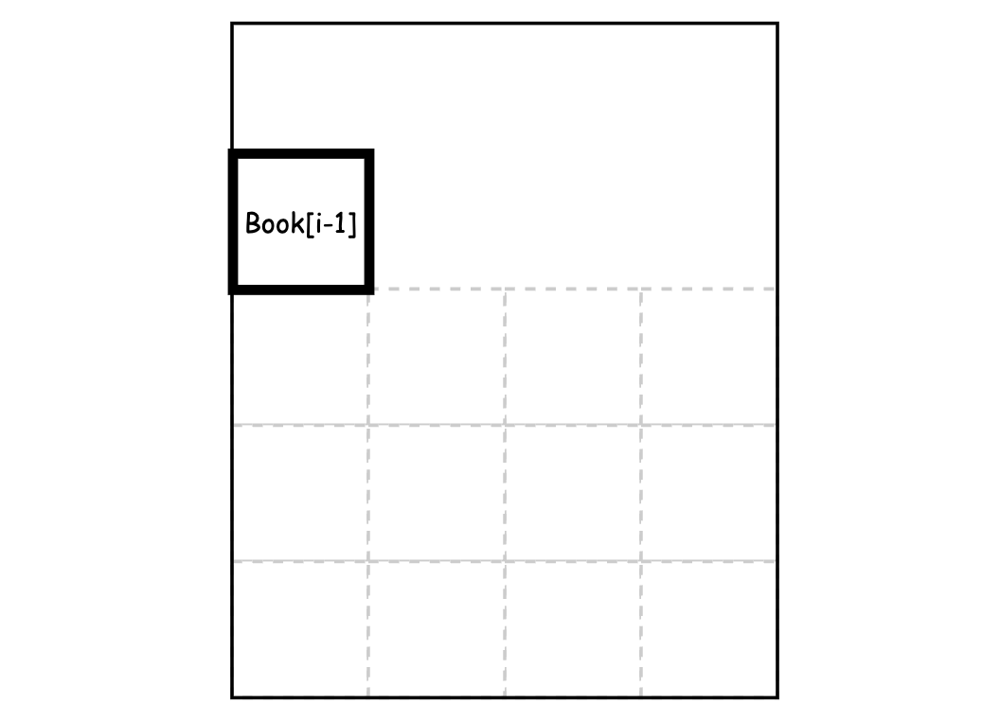
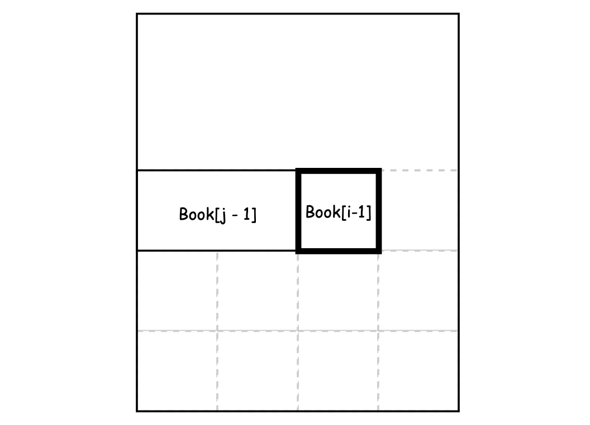
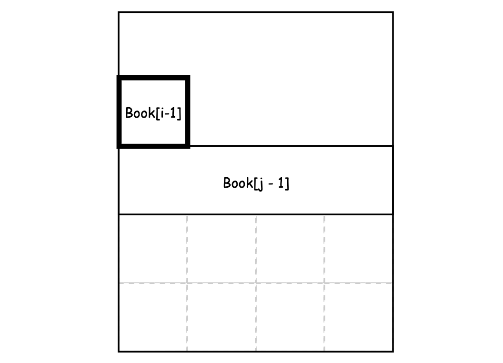

# 1105. Filling Bookcase Shelves

- [1105. Filling Bookcase Shelves](#1105-filling-bookcase-shelves)
  - [문제 분석](#문제-분석)
    - [요구사항](#요구사항)
    - [조건](#조건)
    - [제한사항](#제한사항)
  - [접근방법](#접근방법)
    - [Dynamic Programming](#dynamic-programming)
    - [문제 접근](#문제-접근)
  - [코드분석](#코드분석)

## 문제 분석

### 요구사항

* Return the minimum possible height that the total bookshelf can be after placing shelves in this manner.

⭐️ 키워드 : `minimum possible height`

### 조건

* 책 2차원 배열 `books`
* `books[i] = [thicknessi, heighti]`
* 책선반의 가로 폭 `shelfWidth`

### 제한사항

* `1 <= books.length <= 1000`
* `1 <= thicknessi <= shelfWidth <= 1000`
* `1 <= heighti <= 1000`

## 접근방법

> [쉬운코드 - dynamic programming](https://www.youtube.com/watch?v=GtqHli8HIqk)

DP 문제로 접근해야한다는 것조차 몰랐기 때문에 DP에 대해서 다시 정리했다.

### Dynamic Programming

* DP가 무엇인가요?
  - 문제를 해결하는 최적의 해(Optimal Solution)를 찾는 문제
  - Optimal Solution은 하나 이상일 수 있다.
  - 최소값 혹은 최대값을 찾는 문제가 주로 나온다.

* 어떻게 사용하나요?
  - Subproblem을 정의한다.
  - Subproblem의 Optimal Solution을 구한다.
  - 겹치는 subproblems는 결과를 저장해놓고 재사용한다.
  - Subproblems의 Optimal Solution을 이용하여 문제의 Optimal Solution을 구한다.

* DP 접근방식

|         |   Top-Down  | Bottom-Up  |
|:-------:|-------------|------------|
|   구조   |  Recursive  | Iterative  |
| 저장 방식 | Memoization | Tabulation |
|   활용   | subproblems의 일부만 계산할 때 | 모든 subproblems를 계산할 때 |
    
* 언제 DP를 사용해야하나요?
  - 주어진 문제가 Optimal Substructure인 경우
    - Optimal Substructure : 문제의 최적해가 부분문제의 최적해로부터 구성될 수 있는 경우
  - 주어진 문제가 Overlapping Subproblems을 갖는 경우
    - Overlapping Subproblems : 문제를 해결하는 과정에서 동일한 subproblem을 반복적으로 해결해야 하는 경우

### 문제 접근

해겳해야하는 문제는 책을 책선반에 쌓는데, 책선반의 가로폭을 넘지 않으면서 책선반의 높이를 최소로 만들어야 한다.

이는 높이를 최소로 만든다는 점에서 Optimal Solution을 찾아야하는 문제이다.

또한 높이를 최소로 만들기 위해서는 바로 직전에 쌓은 책의 높이 또한 최소로 만들어야한다.

따라서 해당 문제는 DP로 접근해야한다.

## 코드분석

```java
class Solution {
    public int minHeightShelves(int[][] books, int shelfWidth) {
        int n = books.length;
        int[] dp = new int[n + 1];

        for (int i = 1; i <= n; i++) {
            int width = books[i - 1][0];
            int height = books[i - 1][1];

            dp[i] = dp[i - 1] + height;

            for (int j = i - 1; j > 0; j--) {
                width += books[j - 1][0];
                if (width > shelfWidth) {
                    break;
                }
                height = Math.max(height, books[j - 1][1]);
                dp[i] = Math.min(dp[i], dp[j - 1] + height); 
            }
        }
        return dp[n];
    }
}
```


먼저 현재 책을 책선반에 쌓았을 때의 높이를 구합니다. 이때 현재 책을 쌓았을 때의 높이는 바로 직전 책을 쌓았을 때의 높이에 현재 책의 높이를 더한 값입니다.


다음으로 직전의 책과 같은 높이로 책을 쌓았을 때의 높이를 구합니다. 이때 현재 책을 쌓았을 때의 높이와 직전의 책과 같은 높이로 책을 쌓았을 때의 높이를 비교하여 작은 값을 취합니다.


만약 이미 책선반의 가로폭을 넘어가게 된다면 더 이상 책을 쌓을 수 없으므로 break합니다.

반복문을 모두 돌고나면 dp[n]에는 책선반의 높이를 최소로 만드는 값이 저장되어 있습니다.